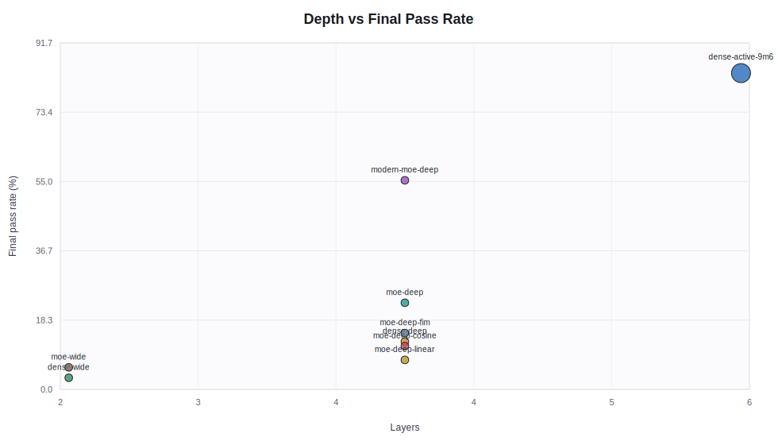
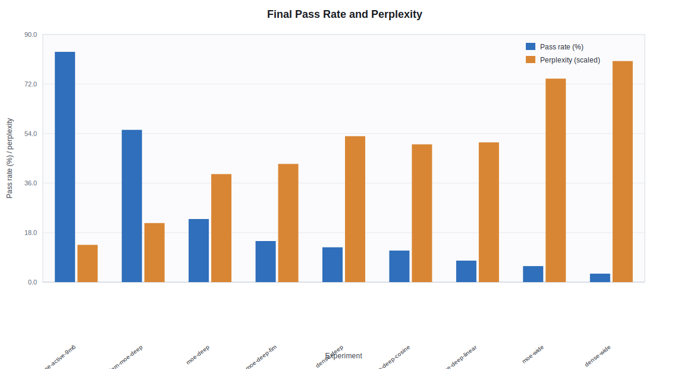

# Python Model Sweep Results

## Overview

Analyzed `C:\Users\berti\Downloads\export_clean.zip` on 2026-06-29. ZIP integrity checks passed for the outer export and all selected nested bundles. The cleaned export contains 9 current experiment bundles.

Bundle selection is deterministic: for each experiment, choose the candidate with the most files, checkpoint-evaluation reports, TensorBoard event files, checkpoint files, and then compressed size. All selected bundles have 65 files, 10 checkpoint evaluation reports, TensorBoard event files, tokenizer files, and a latest checkpoint.

Model parameter counts were computed by validating each `resolved_config.json`, building the configured model with the configured tokenizer vocabulary size, and using `llm_lite.model.parameters.model_parameter_summary`. Checkpoint-evaluation steps were read from TensorBoard event files inside each checkpoint-evaluation artifact. Fixed prompt generation samples were present in checkpoint-evaluation reports and absent from the final full evaluation reports.

Hardware/run notes: the export records `distributed_world_size=2`, `distributed_strategy=data_parallel`, and `precision=bf16` for the analyzed training logs. The exact GPU model, host CPU, and wall-clock environment are not present in the export.

## Key Findings

- `python_dense_active_9m6` is the strongest overall run by final Python completion pass rate (83.70%).
- `python_modern_moe_small_deep_plain` is the strongest sub-2M-active-parameter model (55.34% final pass rate).
- `python_dense_small_wide_plain` is the highest-throughput run at 1,969,557 tokens/s over the last 100 training log points, but its final pass rate is only 3.06%.
- Classic MoE router dominance is a real concern: several runs route nearly all tokens through one expert in the worst layer by the end of training.
- The warmup/decay LR runs likely under-trained relative to fixed LR: their learning rate peaks at the fixed baseline and then decays, while final pass rates lag the fixed-LR MoE baseline.

## Summary Results

| Experiment | Type | Active params | Final train loss | Final eval loss | Final ppl | Final pass rate | Best ckpt pass | Mean TPS last 100 |
| --- | --- | ---: | ---: | ---: | ---: | ---: | ---: | ---: |
| `python_dense_active_9m6` | dense_gpt | 9,646,080 | 0.5566 | 0.3937 | 1.4824 | 83.70% | 83.70% | 564,026 |
| `python_dense_small_deep_plain` | dense_gpt | 994,576 | 2.1484 | 1.7586 | 5.8042 | 12.65% | 12.65% | 1,269,408 |
| `python_dense_small_wide_plain` | dense_gpt | 992,992 | 2.5859 | 2.1738 | 8.7920 | 3.06% | 3.06% | 1,969,557 |
| `python_modern_moe_small_deep_plain` | modern_moe_gpt | 924,440 | 1.2539 | 0.8540 | 2.3490 | 55.34% | 56.13% | 1,053,603 |
| `python_moe_small_deep_cosine_warmup_decay` | moe_gpt | 995,984 | 2.1172 | 1.7013 | 5.4808 | 11.46% | 11.86% | 825,337 |
| `python_moe_small_deep_fim` | moe_gpt | 995,984 | 2.1016 | 1.5480 | 4.7019 | 14.92% | 14.92% | 841,804 |
| `python_moe_small_deep_linear_warmup_decay` | moe_gpt | 995,984 | 2.1562 | 1.7154 | 5.5586 | 7.81% | 8.89% | 845,814 |
| `python_moe_small_deep_plain` | moe_gpt | 995,984 | 1.9180 | 1.4579 | 4.2970 | 22.92% | 22.92% | 836,914 |
| `python_moe_small_wide_plain` | moe_gpt | 993,824 | 2.5234 | 2.0909 | 8.0925 | 5.83% | 6.52% | 1,422,336 |

## Plots

These are generated SVGs checked into `docs/images/python_model_sweep/`. They are static Markdown images; for interactive drill-down, use the TensorBoard event files inside the export bundles.

### Checkpoint Python Completion Pass Rate

Percentage of unit-test checks passed during checkpoint evaluation. Dense 9.6M and modern MoE separate clearly from the small baseline runs.

### Checkpoint AST Parse Rate

Percentage of completion tasks that produced parseable Python ASTs. This isolates syntax validity from semantic correctness.

### Checkpoint Passed Checks

Raw number of passed unit-test checks over training. The total check count is 1,012 for these checkpoint evaluations.

### Active Parameters vs Final Pass Rate

Final full-evaluation pass rate against active parameter count. The x-axis is log-scaled so the 1M-class and 9.6M dense runs are visible together.

### Depth vs Final Pass Rate

Final full-evaluation pass rate by layer count. Point radius scales with active parameter count.

### Final Pass Rate and Perplexity

Final full-evaluation pass rate and validation perplexity. Lower perplexity generally tracks better completion performance here.

## Model And Training Details

| Experiment | Dim | Layers | Heads | FFN/expert FFN | Experts | Top-k | Total params | Active params | Steps | Batch seqs | LR schedule | LR final | Weight decay | Max ckpts | FIM |
| --- | ---: | ---: | ---: | ---: | ---: | ---: | ---: | ---: | ---: | ---: | --- | ---: | ---: | ---: | --- |
| `python_dense_active_9m6` | 320 | 6 | 8 | 1280 | n/a | n/a | 9,646,080 | 9,646,080 | 15000 | 256 | fixed | 0.0010 | 0.1000 | 2 | no |
| `python_dense_small_deep_plain` | 88 | 4 | 4 | 352 | n/a | n/a | 994,576 | 994,576 | 15000 | 256 | fixed | 0.0010 | 0.1000 | 2 | no |
| `python_dense_small_wide_plain` | 104 | 2 | 4 | 416 | n/a | n/a | 992,992 | 992,992 | 15000 | 256 | fixed | 0.0010 | 0.1000 | 2 | no |
| `python_modern_moe_small_deep_plain` | 88 | 4 | 4 | 256 | 4 | 1 | 1,735,448 | 924,440 | 15000 | 256 | fixed | 0.0010 | 0.1000 | 2 | no |
| `python_moe_small_deep_cosine_warmup_decay` | 88 | 4 | 4 | 352 | 4 | 1 | 1,744,688 | 995,984 | 15000 | 256 | cosine_warmup_decay | 0.0001 | 0.1000 | 2 | no |
| `python_moe_small_deep_fim` | 88 | 4 | 4 | 352 | 4 | 1 | 1,744,688 | 995,984 | 15000 | 256 | fixed | 0.0010 | 0.1000 | 2 | yes |
| `python_moe_small_deep_linear_warmup_decay` | 88 | 4 | 4 | 352 | 4 | 1 | 1,744,688 | 995,984 | 15000 | 256 | linear_warmup_decay | 0.0001 | 0.1000 | 2 | no |
| `python_moe_small_deep_plain` | 88 | 4 | 4 | 352 | 4 | 1 | 1,744,688 | 995,984 | 15000 | 256 | fixed | 0.0010 | 0.1000 | 2 | no |
| `python_moe_small_wide_plain` | 104 | 2 | 4 | 416 | 4 | 1 | 1,516,112 | 993,824 | 15000 | 256 | fixed | 0.0010 | 0.1000 | 2 | no |

## Checkpoint Peaks

Checkpoint evaluations used the smaller validation slice in the export. This table keeps only the peak and final checkpoint signals; full trajectories are shown in the plots above.

| Experiment | Best val step/ppl | Best pass step/rate | Final ckpt pass | Final vs best pass |
| --- | --- | --- | ---: | ---: |
| `python_dense_active_9m6` | 13500/1.4583 | 15000/83.70% | 83.70% | +0.00 pp |
| `python_dense_small_deep_plain` | 15000/5.7379 | 15000/12.65% | 12.65% | +0.00 pp |
| `python_dense_small_wide_plain` | 15000/8.6964 | 15000/3.06% | 3.06% | +0.00 pp |
| `python_modern_moe_small_deep_plain` | 15000/2.2939 | 13500/56.13% | 55.34% | -0.79 pp |
| `python_moe_small_deep_cosine_warmup_decay` | 13500/5.4501 | 13500/11.86% | 11.46% | -0.40 pp |
| `python_moe_small_deep_fim` | 15000/4.6840 | 15000/14.92% | 14.92% | +0.00 pp |
| `python_moe_small_deep_linear_warmup_decay` | 15000/5.4937 | 4500/8.89% | 7.81% | -1.09 pp |
| `python_moe_small_deep_plain` | 15000/4.2265 | 15000/22.92% | 22.92% | +0.00 pp |
| `python_moe_small_wide_plain` | 13500/8.0068 | 12000/6.52% | 5.83% | -0.69 pp |

## Anomalies And Observations

- `python_dense_active_9m6`: No export-level anomaly found.
- `python_dense_small_deep_plain`: No export-level anomaly found.
- `python_dense_small_wide_plain`: No export-level anomaly found.
- `python_modern_moe_small_deep_plain`: No export-level anomaly found.
- `python_moe_small_deep_cosine_warmup_decay`: MoE router shows severe final expert dominance (0.9099).
- `python_moe_small_deep_fim`: MoE router shows severe final expert dominance (0.9869). MoE router final entropy is very low (0.0606).
- `python_moe_small_deep_linear_warmup_decay`: Checkpoint pass rate ended -1.09 pp below best.
- `python_moe_small_deep_plain`: MoE router shows severe final expert dominance (0.9834). MoE router final entropy is very low (0.0736).
- `python_moe_small_wide_plain`: Checkpoint validation loss degraded by +0.0116 versus best. MoE router shows severe final expert dominance (0.9861). MoE router final entropy is very low (0.0636).

## Interpretation And Recommendations

Prefer the model family that improves Python completion pass rate without a large validation-perplexity or throughput penalty. Treat checkpoint-evaluation pass rate as noisy because it is derived from a fixed held-out task set, but use it to decide whether a run peaked before the final checkpoint.

Concrete next experiments:

- Re-run the strongest small configuration with multiple seeds to separate architecture signal from task-sampling variance.
- For MoE runs with router dominance above 0.90, test stronger auxiliary balancing, router noise/jitter, or top-k=2 before increasing expert count.
- If FIM improves completion metrics, run a probability sweep rather than a binary plain/FIM comparison.
- For learning-rate schedules, sweep warmup length and minimum LR ratio around the best schedule instead of only comparing schedule families.
- Evaluate the best checkpoint, not only the final checkpoint, on the full validation set and Python completion suite.
- Record hardware metadata in future exports: GPU model/count, CPU, RAM, driver/CUDA/PyTorch versions, and wall-clock start/end timestamps.

## Limitations

- Hardware details beyond distributed world size and strategy are absent from the export.
- Checkpoint-evaluation validation metrics use 200 validation documents, while final evaluation uses 464 documents; those losses/perplexities are related but not strictly identical measurements.
- TensorBoard scalar extraction covers scalar tags and does not decode histogram distributions beyond the scalar router summaries.
- The export contains only the latest checkpoint file for each selected run, not all checkpoint weights.

