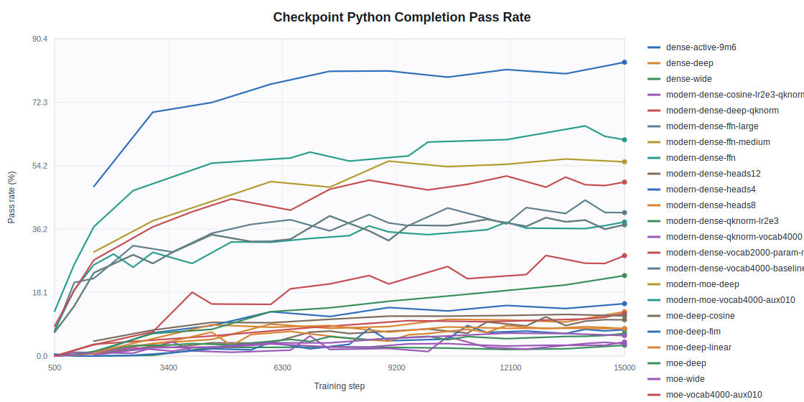
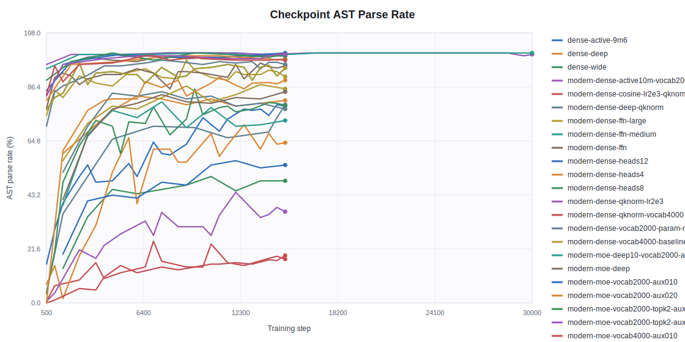
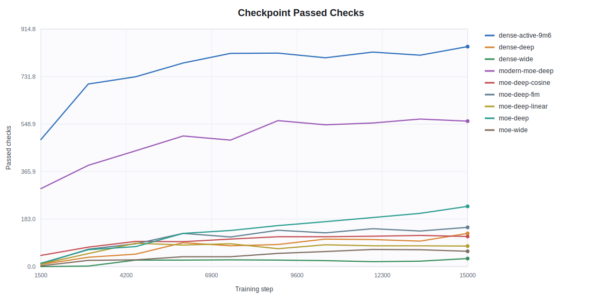
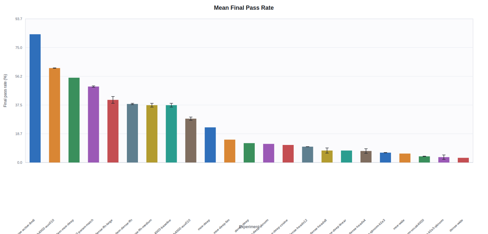
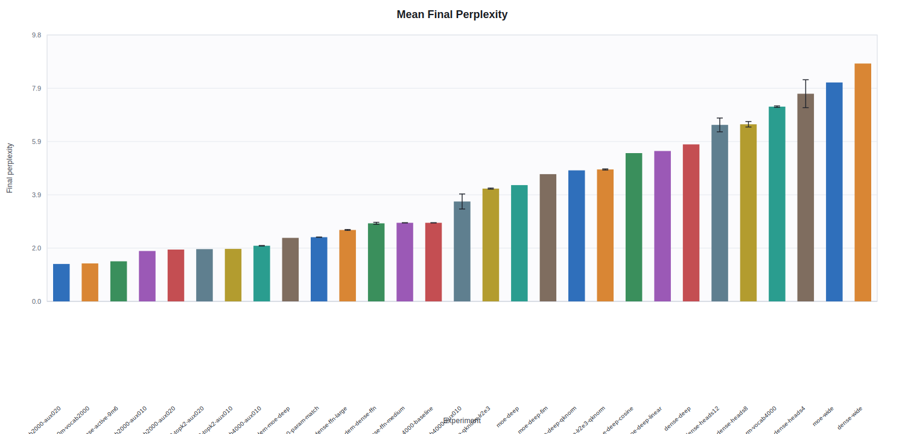
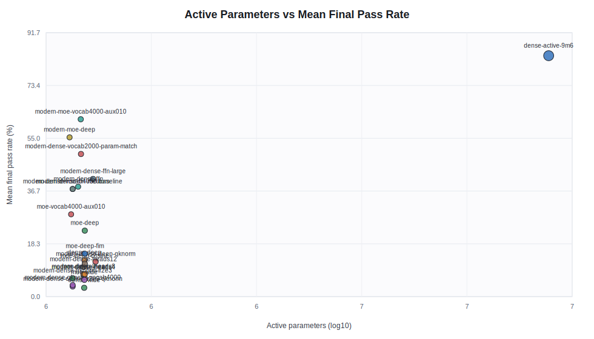

# Python Model Sweep Results

Aggregated 36 selected runs into 23 experiment groups on 2026-06-30.

Source identity is intentionally ignored. The input was 3 ZIP exports with 37 candidate bundles; duplicate experiment names are grouped before reporting.

Numeric cells use `mean +/- population standard deviation` across runs with the same experiment name. Static configuration fields are shown once when they are identical across the group.

## Key Findings

- Best mean final pass rate: `python_dense_active_9m6` at 83.70% +/- 0.00 pp.
- Best sub-2M-active-parameter model: `python_modern_moe_vocab4000_aux010` at 61.61% +/- 0.15 pp.
- Highest mean late-training throughput: `python_modern_dense_heads4` at 3,219,395 +/- 325,484 tokens/s.
- Largest repeated-run final-pass variation: `python_modern_dense_ffn_large` at 40.86% +/- 2.22 pp.

## Aggregated Results

| Experiment | Runs | Type | Active params | Total params | Dim | Layers | Heads | FFN/expert FFN | Experts/top-k | Final pass | Best ckpt pass | Final ppl | Final eval loss | Train loss | Mean TPS last 100 |
| --- | ---: | --- | ---: | ---: | ---: | ---: | ---: | ---: | --- | ---: | ---: | ---: | ---: | ---: | ---: |
| `python_dense_active_9m6` | 1 | dense_gpt | 9,646,080 | 9,646,080 | 320 | 6 | 8 | 1,280 | n/a | 83.70% +/- 0.00 pp | 83.70% +/- 0.00 pp | 1.4824 +/- 0.0000 | 0.3937 +/- 0.0000 | 0.5566 +/- 0.0000 | 564,026 +/- 0 |
| `python_modern_moe_vocab4000_aux010` | 2 | modern_moe_gpt | 976,224 | 2,303,328 | 96 | 4 | 4 | 384 | 4/1 | 61.61% +/- 0.15 pp | 65.56% +/- 1.93 pp | 2.0561 +/- 0.0096 | 0.7208 +/- 0.0047 | 1.1445 +/- 0.0078 | 968,138 +/- 65,164 |
| `python_modern_moe_small_deep_plain` | 1 | modern_moe_gpt | 924,440 | 1,735,448 | 88 | 4 | 4 | 256 | 4/1 | 55.34% +/- 0.00 pp | 56.13% +/- 0.00 pp | 2.3490 +/- 0.0000 | 0.8540 +/- 0.0000 | 1.2539 +/- 0.0000 | 1,053,603 +/- 0 |
| `python_modern_dense_vocab2000_param_match` | 2 | modern_dense_gpt | 977,536 | 977,536 | 128 | 2 | 4 | 768 | n/a | 49.56% +/- 0.44 pp | 50.64% +/- 0.64 pp | 2.3732 +/- 0.0058 | 0.8642 +/- 0.0024 | 1.2422 +/- 0.0000 | 2,810,513 +/- 125,373 |
| `python_modern_dense_ffn_large` | 2 | modern_dense_gpt | 1,036,928 | 1,036,928 | 128 | 2 | 4 | 512 | n/a | 40.86% +/- 2.22 pp | 44.42% +/- 0.74 pp | 2.6404 +/- 0.0171 | 0.9709 +/- 0.0065 | 1.4023 +/- 0.0078 | 2,543,670 +/- 261,731 |
| `python_modern_dense_ffn_small` | 2 | modern_dense_gpt | 963,792 | 963,792 | 144 | 2 | 4 | 256 | n/a | 38.19% +/- 0.44 pp | 38.59% +/- 0.05 pp | 2.8854 +/- 0.0381 | 1.0596 +/- 0.0132 | 1.4844 +/- 0.0039 | 2,452,374 +/- 194,053 |
| `python_modern_dense_ffn_medium` | 2 | modern_dense_gpt | 938,624 | 938,624 | 128 | 2 | 4 | 384 | n/a | 37.40% +/- 1.24 pp | 39.82% +/- 0.40 pp | 2.9053 +/- 0.0047 | 1.0665 +/- 0.0016 | 1.4727 +/- 0.0156 | 2,587,256 +/- 277,548 |
| `python_modern_dense_vocab4000_baseline` | 2 | modern_dense_gpt | 938,624 | 938,624 | 128 | 2 | 4 | 384 | n/a | 37.40% +/- 1.24 pp | 39.82% +/- 0.40 pp | 2.9053 +/- 0.0047 | 1.0665 +/- 0.0016 | 1.4727 +/- 0.0156 | 2,587,256 +/- 277,548 |
| `python_moe_vocab4000_aux010` | 2 | moe_gpt | 931,392 | 1,821,888 | 96 | 4 | 4 | 384 | 4/1 | 28.61% +/- 1.04 pp | 28.61% +/- 1.04 pp | 3.6925 +/- 0.2779 | 1.3035 +/- 0.0754 | 1.8164 +/- 0.0742 | 1,088,279 +/- 72,882 |
| `python_moe_small_deep_plain` | 1 | moe_gpt | 995,984 | 1,744,688 | 88 | 4 | 4 | 352 | 4/1 | 22.92% +/- 0.00 pp | 22.92% +/- 0.00 pp | 4.2970 +/- 0.0000 | 1.4579 +/- 0.0000 | 1.9180 +/- 0.0000 | 836,914 +/- 0 |
| `python_moe_small_deep_fim` | 1 | moe_gpt | 995,984 | 1,744,688 | 88 | 4 | 4 | 352 | 4/1 | 14.92% +/- 0.00 pp | 14.92% +/- 0.00 pp | 4.7019 +/- 0.0000 | 1.5480 +/- 0.0000 | 2.1016 +/- 0.0000 | 841,804 +/- 0 |
| `python_dense_small_deep_plain` | 1 | dense_gpt | 994,576 | 994,576 | 88 | 4 | 4 | 352 | n/a | 12.65% +/- 0.00 pp | 12.65% +/- 0.00 pp | 5.8042 +/- 0.0000 | 1.7586 +/- 0.0000 | 2.1484 +/- 0.0000 | 1,269,408 +/- 0 |
| `python_modern_dense_deep_qknorm` | 1 | modern_dense_gpt | 1,049,952 | 1,049,952 | 96 | 12 | 6 | 64 | n/a | 12.15% +/- 0.00 pp | 12.15% +/- 0.00 pp | 4.8423 +/- 0.0000 | 1.5774 +/- 0.0000 | 2.1016 +/- 0.0000 | 627,134 +/- 0 |
| `python_moe_small_deep_cosine_warmup_decay` | 1 | moe_gpt | 995,984 | 1,744,688 | 88 | 4 | 4 | 352 | 4/1 | 11.46% +/- 0.00 pp | 11.86% +/- 0.00 pp | 5.4808 +/- 0.0000 | 1.7013 +/- 0.0000 | 2.1172 +/- 0.0000 | 825,337 +/- 0 |
| `python_modern_dense_heads12` | 2 | modern_dense_gpt | 989,760 | 989,760 | 192 | 1 | 12 | 128 | n/a | 10.33% +/- 0.05 pp | 10.77% +/- 0.40 pp | 6.5221 +/- 0.2550 | 1.8744 +/- 0.0391 | 2.1406 +/- 0.0234 | 2,496,517 +/- 102,525 |
| `python_modern_dense_heads8` | 2 | modern_dense_gpt | 989,760 | 989,760 | 192 | 1 | 8 | 128 | n/a | 7.81% +/- 1.68 pp | 8.65% +/- 0.84 pp | 6.5465 +/- 0.1007 | 1.8788 +/- 0.0154 | 2.1680 +/- 0.0117 | 2,751,674 +/- 258,220 |
| `python_moe_small_deep_linear_warmup_decay` | 1 | moe_gpt | 995,984 | 1,744,688 | 88 | 4 | 4 | 352 | 4/1 | 7.81% +/- 0.00 pp | 8.89% +/- 0.00 pp | 5.5586 +/- 0.0000 | 1.7154 +/- 0.0000 | 2.1562 +/- 0.0000 | 845,814 +/- 0 |
| `python_modern_dense_heads4` | 2 | modern_dense_gpt | 989,760 | 989,760 | 192 | 1 | 4 | 128 | n/a | 7.51% +/- 1.48 pp | 8.10% +/- 0.99 pp | 7.6753 +/- 0.5158 | 2.0357 +/- 0.0673 | 2.3125 +/- 0.0547 | 3,219,395 +/- 325,484 |
| `python_modern_dense_qknorm_lr2e3` | 2 | modern_dense_gpt | 938,624 | 938,624 | 128 | 2 | 4 | 384 | n/a | 6.42% +/- 0.10 pp | 6.87% +/- 0.54 pp | 4.1693 +/- 0.0194 | 1.4277 +/- 0.0047 | 1.9336 +/- 0.0039 | 2,432,856 +/- 128,768 |
| `python_moe_small_wide_plain` | 1 | moe_gpt | 993,824 | 1,516,112 | 104 | 2 | 4 | 416 | 4/1 | 5.83% +/- 0.00 pp | 6.52% +/- 0.00 pp | 8.0925 +/- 0.0000 | 2.0909 +/- 0.0000 | 2.5234 +/- 0.0000 | 1,422,336 +/- 0 |
| `python_modern_dense_qknorm_vocab4000` | 2 | modern_dense_gpt | 938,624 | 938,624 | 128 | 2 | 4 | 384 | n/a | 4.00% +/- 0.15 pp | 4.00% +/- 0.15 pp | 7.1972 +/- 0.0288 | 1.9737 +/- 0.0040 | 2.5273 +/- 0.0039 | 2,336,695 +/- 227,625 |
| `python_modern_dense_cosine_lr2e3_qknorm` | 2 | modern_dense_gpt | 938,624 | 938,624 | 128 | 2 | 4 | 384 | n/a | 3.51% +/- 1.43 pp | 4.10% +/- 1.63 pp | 4.8757 +/- 0.0207 | 1.5843 +/- 0.0042 | 2.1055 +/- 0.0039 | 2,457,548 +/- 185,044 |
| `python_dense_small_wide_plain` | 1 | dense_gpt | 992,992 | 992,992 | 104 | 2 | 4 | 416 | n/a | 3.06% +/- 0.00 pp | 3.06% +/- 0.00 pp | 8.7920 +/- 0.0000 | 2.1738 +/- 0.0000 | 2.5859 +/- 0.0000 | 1,969,557 +/- 0 |

## Plots

Checkpoint evaluations are shown only as plots; the full per-step table is intentionally omitted.

### Checkpoint Python Completion Pass Rate

Mean checkpoint pass rate by experiment. Repeated runs are averaged per step.

### Checkpoint AST Parse Rate

Mean parseable-completion rate by experiment and checkpoint step.

### Checkpoint Passed Checks

Mean number of unit-test checks passed by experiment and checkpoint step.

### Mean Final Pass Rate

Mean final pass rate with +/- one population standard deviation.

### Mean Final Perplexity

Mean final validation perplexity with +/- one population standard deviation.

### Active Parameters vs Mean Final Pass Rate

Mean final pass rate against active parameter count.

## Router Observations

| Experiment | Runs | Final worst-layer dominance | Final worst-layer entropy | Observation |
| --- | ---: | ---: | ---: | --- |
| `python_modern_moe_small_deep_plain` | 1 | 0.5504 +/- 0.0000 | 0.6003 +/- 0.0000 | router usage less collapsed |
| `python_modern_moe_vocab4000_aux010` | 2 | 0.7363 +/- 0.0051 | 0.6179 +/- 0.0041 | router usage less collapsed |
| `python_moe_small_deep_cosine_warmup_decay` | 1 | 0.9099 +/- 0.0000 | 0.2628 +/- 0.0000 | severe expert dominance |
| `python_moe_small_deep_fim` | 1 | 0.9869 +/- 0.0000 | 0.0606 +/- 0.0000 | severe expert dominance |
| `python_moe_small_deep_linear_warmup_decay` | 1 | 0.7774 +/- 0.0000 | 0.4376 +/- 0.0000 | router usage less collapsed |
| `python_moe_small_deep_plain` | 1 | 0.9834 +/- 0.0000 | 0.0736 +/- 0.0000 | severe expert dominance |
| `python_moe_small_wide_plain` | 1 | 0.9861 +/- 0.0000 | 0.0636 +/- 0.0000 | severe expert dominance |
| `python_moe_vocab4000_aux010` | 2 | 0.9520 +/- 0.0137 | 0.1726 +/- 0.0388 | severe expert dominance |

## Interpretation

`python_modern_moe_vocab4000_aux010` is the best small-model direction by aggregate final pass rate. Its checkpoint curve still matters: use the checkpoint plots to pick the full-evaluation checkpoint rather than assuming the final checkpoint is optimal.

Classic MoE runs with high router dominance should be treated as router-collapse experiments before scaling expert count. The modern MoE result is the stronger small-model branch in these runs.

