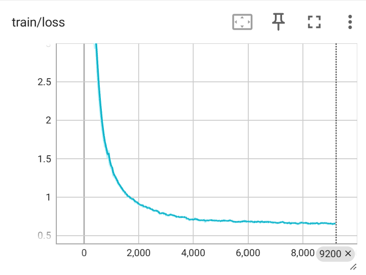
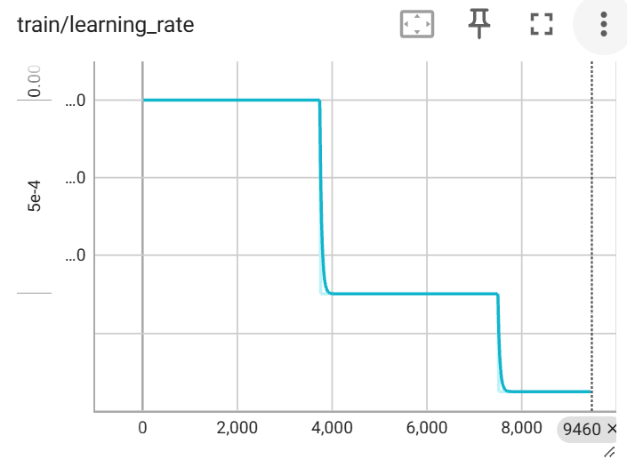

# Results

This page records validated experiments and their interpretation. It separates
measured outcomes from planned work.

## TinyPython MoE Run

The latest meaningful experiment is the TinyPython MoE run configured by:

```text
configs/python_moe_full.yaml
```

The run validates the full artifact-producing path for the current project:
project-generated synthetic data, Hugging Face dataset ingestion, preprocessing,
Rust byte-level BPE tokenizer training, packed datasets, distributed MoE
pretraining, checkpoint resume, KV-cache inference, perplexity evaluation,
Python completion evaluation, TensorBoard logging, performance logging, and
run-bundle export.

It should be read as a small systems/project validation and a constrained Python
baseline, not as a broadly capable code model.

### Dataset

- Source: `BertilBraun/TinyPython`.
- Public dataset:
  <https://huggingface.co/datasets/BertilBraun/TinyPython>.
- Origin: generated by this repository with
  `llm_lite.scripts.generate_tinypython`, then uploaded to Hugging Face.
- Published corpus size: about 2.19M rows in the default/combined view, with
  `big`, `small`, `qwen25_coder_7b`, and `phi4_mini` subsets.
- Format: task description, blank line, then complete typed function code.
- Input split: streamed from the Hugging Face `train` split and partitioned into
  validation, test, and train subsets.
- Preprocessing: Unicode normalization, line-ending normalization, length
  filters, and exact deduplication.
- Packed training set: 610,638 sequences.
- Non-padding tokens: approximately 156.9M.
- Packing efficiency: average sequence fill 0.99999, pad fraction about
  0.0000075.

The synthetic generation script records the teacher model, semantic seed,
sample index, task family, operation tags, function signature, normalized task
description, task description, and code. Invalid generations are written
separately with rejection reasons, which made it possible to iterate on corpus
quality before training.

### Model

- Architecture: top-1 MoE GPT.
- Dimension: 320.
- Layers: 6.
- Attention heads: 8.
- Experts: 4.
- Expert FFN dimension: 1280.
- Auxiliary router loss weight: 0.01.
- Vocabulary: 6000-token Rust byte-level BPE.
- Total parameters: 24,428,160.
- Active parameters per token: 9,653,760.

### Training

- Distributed data parallel, world size 2.
- BF16 precision.
- Batch size: 512 packed sequences per rank.
- Checkpoint and evaluation interval: 500 steps.
- Phase 1: 3,750 steps at LR 0.001.
- Phase 2: continued to 7,500 steps at LR 0.0005.
- Phase 3: continued to 10,000 steps at LR 0.00025.

The committed `configs/python_moe_full.yaml` currently represents the first
phase. The later phases were run by editing `training.maximum_steps` and
`training.optimizer.learning_rate` between compatible resumes.

Training curves:





### Final Evaluation

- Validation perplexity: 1.5516.
- Validation loss: 0.4393.
- Python completion tasks: 174.
- Parsed completions: 172.
- Executed completions: 157.
- Passed checks: 786 / 1012.
- Pass rate: 0.7767.

### Qualitative Behavior

The model learned the dominant task-description-to-function format and often
emits parseable, executable Python. It handles many simple list, dictionary, and
numeric patterns.

Representative strengths:

- Simple list filtering, counting, and summing.
- Basic dictionary selection and aggregation.
- Local numeric transformations.
- Typed standalone function formatting.

Representative weaknesses:

- Exact semantic instruction following.
- Literal replacement, for example replacing digits with a specific character.
- Case-sensitive string tasks.
- Distinguishing nearby task families, such as string reversal versus character
  filtering.

The 10,000-step continuation lowered perplexity but did not improve Python
completion pass rate over the 7,500-step checkpoint. Further gains should come
from better data coverage, targeted heldout families, or evaluation-shaped
training examples rather than only extending this exact run.

### Generated Examples

Successful list example:

```text
Given a list of integers, write a function that returns the sum of all odd numbers in the list.
```

```python
def sum_odd_numbers(numbers: list[int]) -> int:
    total = 0
    for number in numbers:
        if number % 2 != 0:
            total += number
    return total
```

Successful dictionary example:

```text
Given a dictionary mapping strings to integers, write a function that returns the key with the largest value. If the dictionary is empty, return None.
```

```python
def find_largest_key(mapping: dict[str, int]) -> str | None:
    if not mapping:
        return None
    max_key = max(mapping, key=mapping.get)
    return max_key
```

Representative failure:

```text
Replace all digits in the input string with the "#" character.
```

```python
def replace_digits(s: str) -> str:
    result: str = ""
    for char in s:
        if char.isdigit():
            result += char
        else:
            result += char
    return result
```

This parses and executes, but it preserves digits instead of replacing them with
`"#"`, which matches the observed weakness on literal replacement.

### Reproduction Commands

Prepare data artifacts:

```bash
python -m llm_lite.scripts.run_pipeline \
  --config configs/python_moe_full.yaml \
  --to packed_dataset
```

Run distributed pretraining on two GPUs:

```bash
CUDA_VISIBLE_DEVICES=0,1 torchrun --standalone --nproc_per_node=2 \
  -m llm_lite.scripts.run_pipeline \
  --config configs/python_moe_full.yaml \
  --from pretraining \
  --to pretraining
```

Run final evaluation:

```bash
python -m llm_lite.scripts.run_pipeline \
  --config configs/python_moe_full.yaml \
  --from evaluation \
  --to evaluation \
  --force evaluation
```

Generate a sample:

```bash
python -m llm_lite.scripts.generate \
  --config configs/python_moe_full.yaml \
  --prompt "Given a dictionary mapping strings to integers, write a function that returns the key with the largest value. If the dictionary is empty, return None." \
  --maximum-new-tokens 160 \
  --include-prompt
```

Export the run:

```bash
python -m llm_lite.scripts.export_run_bundle \
  --run-dir runs/python_moe_full \
  --output python_moe_full_bundle.zip
```

## Earlier Validation Runs

### One-Sentence Verification

Config:

```text
configs/verify_one_sentence.yaml
```

Purpose:

- Validate the full minimal stage path.
- Train a tiny character-level dense GPT on `hello world\n`.
- Verify checkpointing, resume, generation, and exact reproduction.

Command:

```bash
python -m llm_lite.scripts.run_pipeline \
  --config configs/verify_one_sentence.yaml
```

### TinyStories MoE Validation

Config:

```text
configs/tinystories_moe_full.yaml
```

Purpose:

- Validate Hugging Face streaming over `roneneldan/TinyStories`.
- Validate Rust byte-level BPE, packed story data, MoE training, distributed
  execution, checkpointing, perplexity, and generation samples.

Recorded local validation notes from June 24, 2026:

- Two RTX 4090 GPUs.
- 4096-token Rust byte-level BPE.
- 6-layer top-1 MoE decoder.
- 4 experts.
- Approximately 9.0M total parameters and 3.7M active parameters.
- 50,000 training steps.
- Data-parallel world size 2.
- Final logged training loss: 2.40625.
- Training-time validation perplexity at step 50,000: 6.1347.
- Final evaluation perplexity over 500 validation documents: 6.8403.
- Final evaluation loss: 1.9228.
- Throughput: approximately 487k global tokens/s, or 243k tokens/s per GPU
  rank.

The run was sufficient to validate the story pipeline path. Generated samples
showed TinyStories-like structure, dialogue, and simple continuations, with
expected small-model issues such as repetition, grammar errors, semantic drift,
and occasional replacement characters.

This run was intentionally useful before the Python work because it was fast,
easy to launch, and made failures in tokenization, packing, MoE training,
distributed execution, checkpointing, and generation visible quickly.
